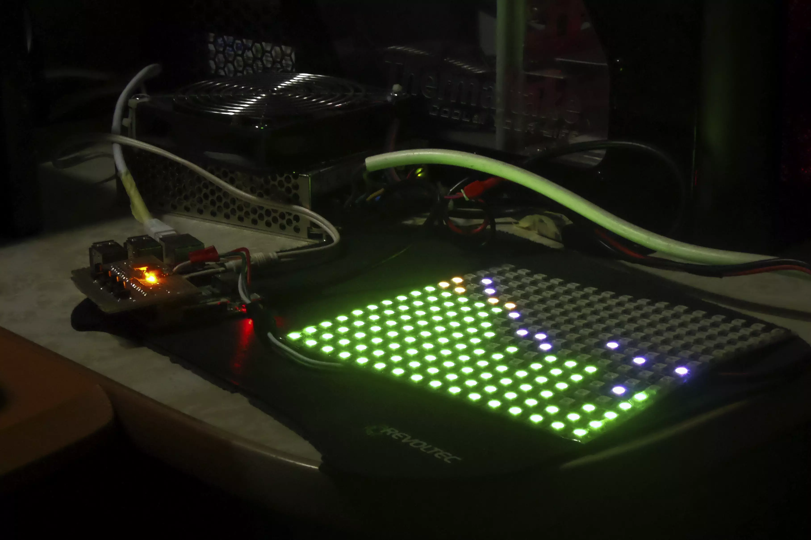
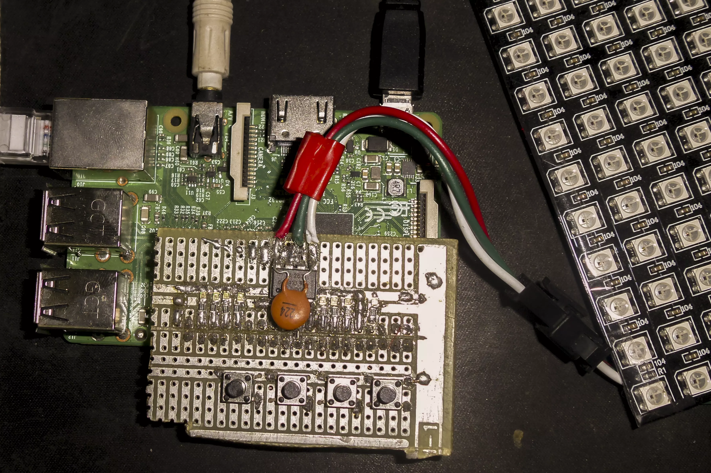
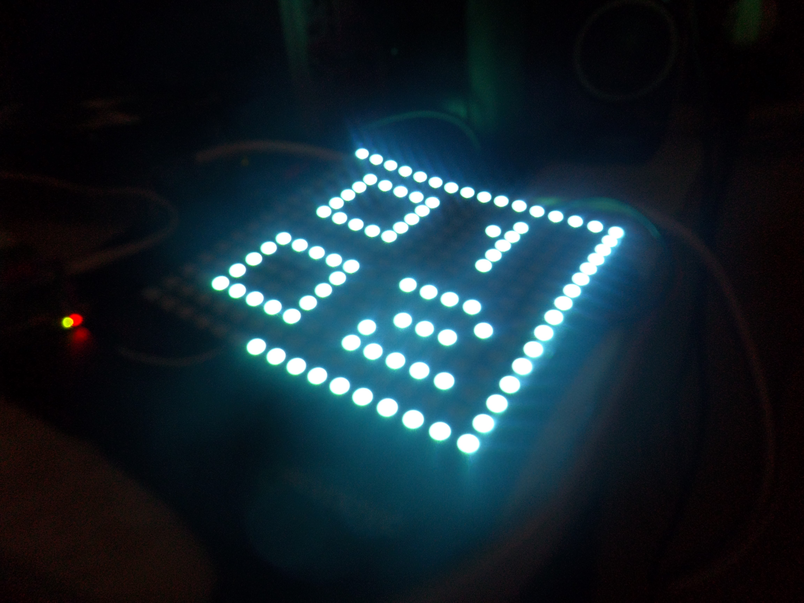

# Smart LED Board 
###### Prototyp obsługi matrycy LED 16x16 przez Raspberry Pi 3+







<video width="320" height="240" controls>
  <source src="https://github.com/informacja/Smart_LED_board/blob/master/obj/soundV.mp4" type="video/mp4">
Your browser does not support the video tag.
</video>
<p><a href="./obj/soundV.mp4" download="Sound test.mp4"> Open </a> & Download <p> 


<h2>Simple tutorial how to use command line git on RPi (configured):</h2>

```YAML
  git add . 
  git commit -m "Message eg. First Sound Test"
  git pull # download and apply changes on local repository
  git push 
```

<h2> How to configure Code::Blocks</h2>
<p><i> Project->Build options...->Linker settings</i><br>
Add to "Other linker options:"</p>

```text
-lasound
-lpthread
-lncurses 
```


<p>And in <i>Project->Build options...->Search directories </i><br> 
Add to "Compiler" </p>

```text
include
```
