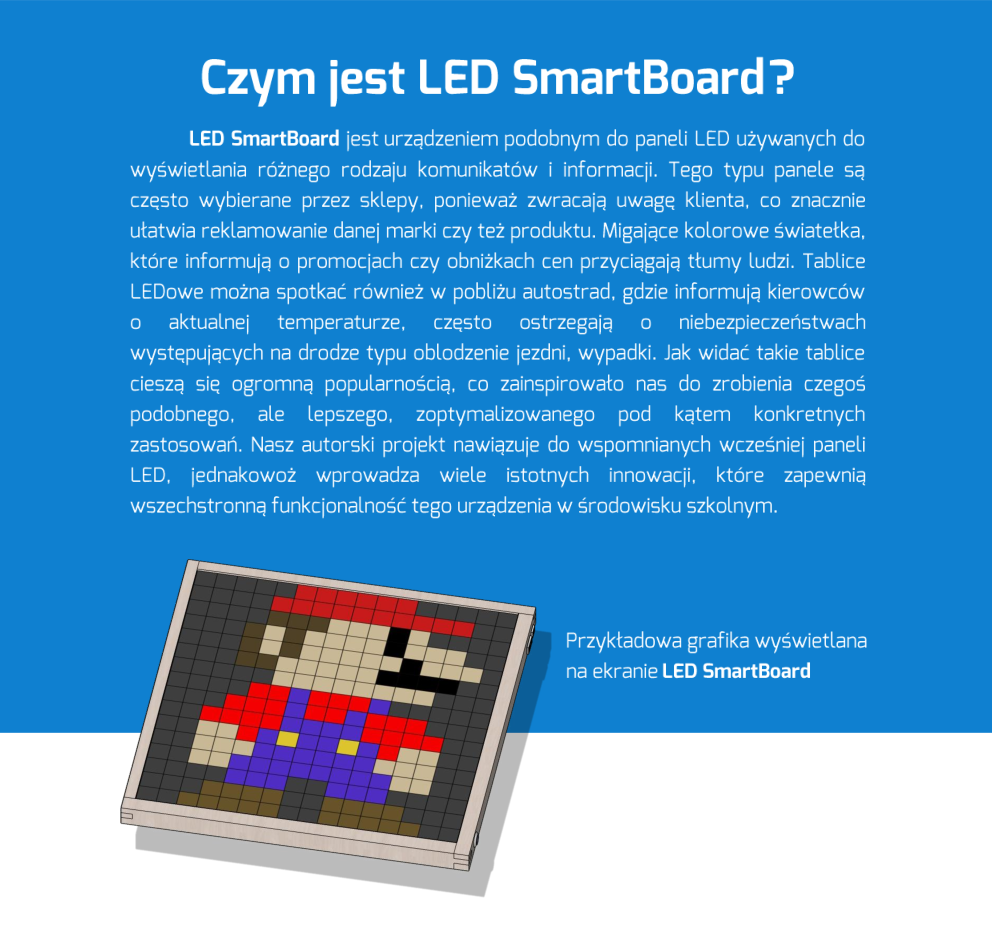
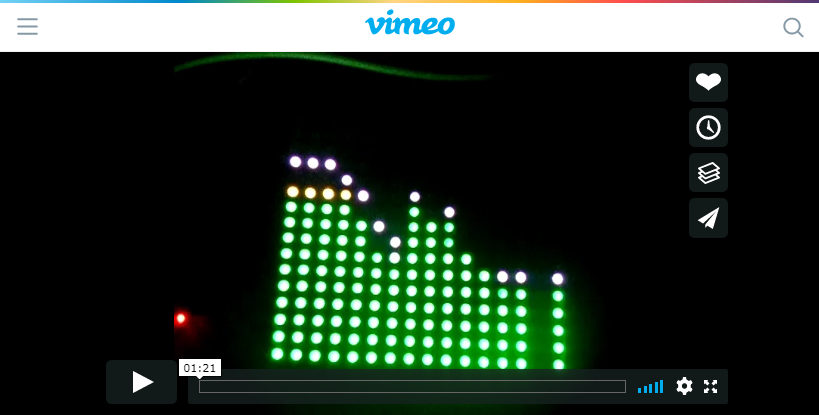
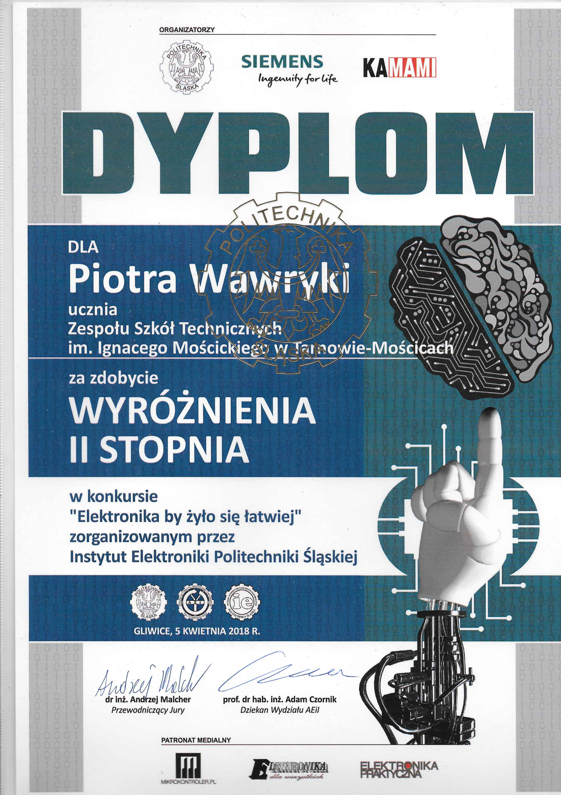

<!-- # Smart LED Board  -->

[
 
](https://drive.google.com/file/d/0B1YxDP48xFw6Vi02YWFwMk1Ba2M/view)

> *Autorzy współtworzący projekt*
> 
> Paweł Piątek - *Opiekun* · 
> Sławomir Franczyk - *Pomysłodawca* · 
> Daniel Król - *Wsparcie merytoryczne* ·
> Kasia Lachut · 
> Przemysław Kuca  · 
> Bartłomiej Mirek · 
> Dominik Kras ·
> Piotr Wawryka 

##### Osiągnięcia
[*Elektronika by żyło się łatwiej* - Politechnika Śląska](obj/ps.pdf)


##### Prototyp obsługi matrycy LED 16x16 przez Raspberry Pi 3+


[
  
](https://vimeo.com/257765594)


[
  
](https://vimeo.com/249725802)


By Sławomir Franczyk


<p><a href="./obj/soundV.mp4" download="Sound test.mp4">   Download  soundV.mp4</a><p> 


<!--  -->
## Audio playing response 


## Signal freq linear incrementation[time domain], spectrum looks non linear[freq domain] (ToDo: Bark Scale)


<h2>Simple tutorial how to use command line git on RPi (configured):</h2>

```YAML
  git add . 
  git commit -m "Message eg. First Sound Test"
  git pull # download and apply changes on local repository
  git push 
```

<h2> How to configure Code::Blocks</h2>
<p><i> Project->Build options...->Linker settings</i><br>
Add to "Other linker options:"</p>

```text
-lasound
-lpthread
-lncurses 
```


<p>And in <i>Project->Build options...->Search directories </i><br> 
Add to "Compiler" </p>

```text
include
```


