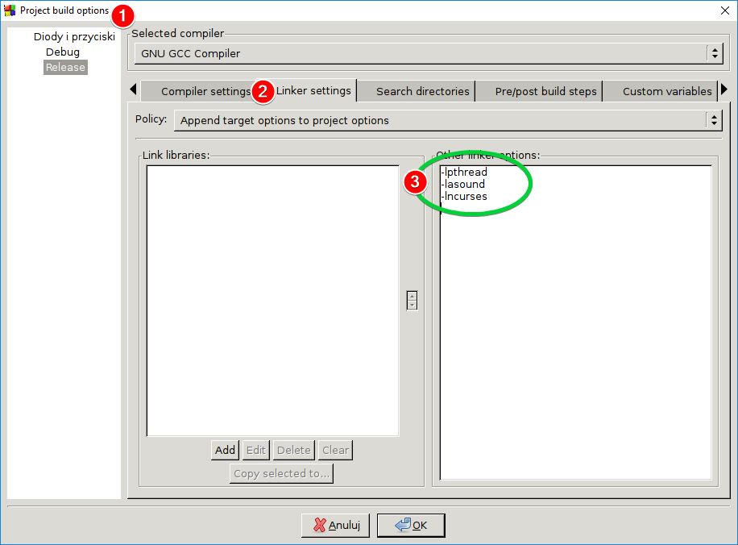

# Smart_LED_board 
Prototyp obsługi matrycy LED 16x16 przez Raspberry Pi 3+


<video width="320" height="240" controls>
  <source src="https://github.com/informacja/Smart_LED_board/blob/master/obj/soundV.mp4" type="video/mp4">
Your browser does not support the video tag.
</video>

<h2>Simple tutorial how to use command line git on RPi (configured):</h2>

```bash
  git add . 
  git commit -m "Message eg. First Sound Test"
  git pull #jeśli wprowadzono zmiany w projekcie przez stronę (pobiera i aktualizuje lokalne)
  git push 
```

<h2> How to configure Code::Blocks</h2>



